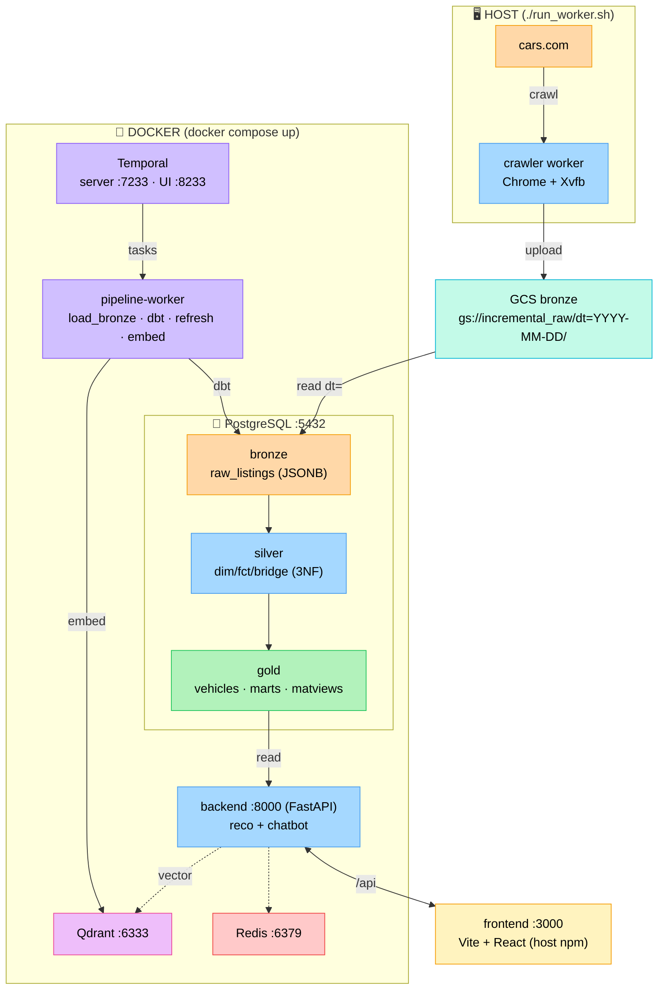
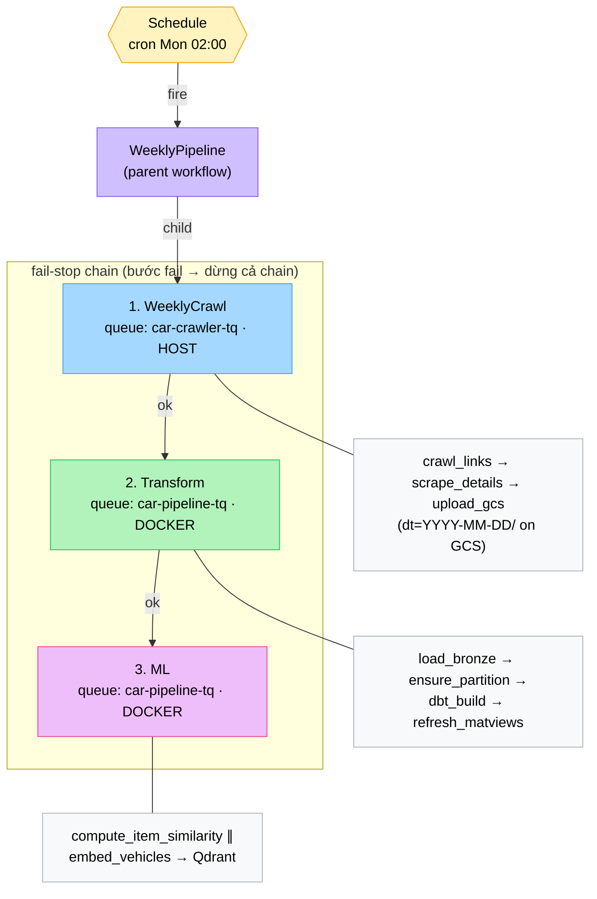
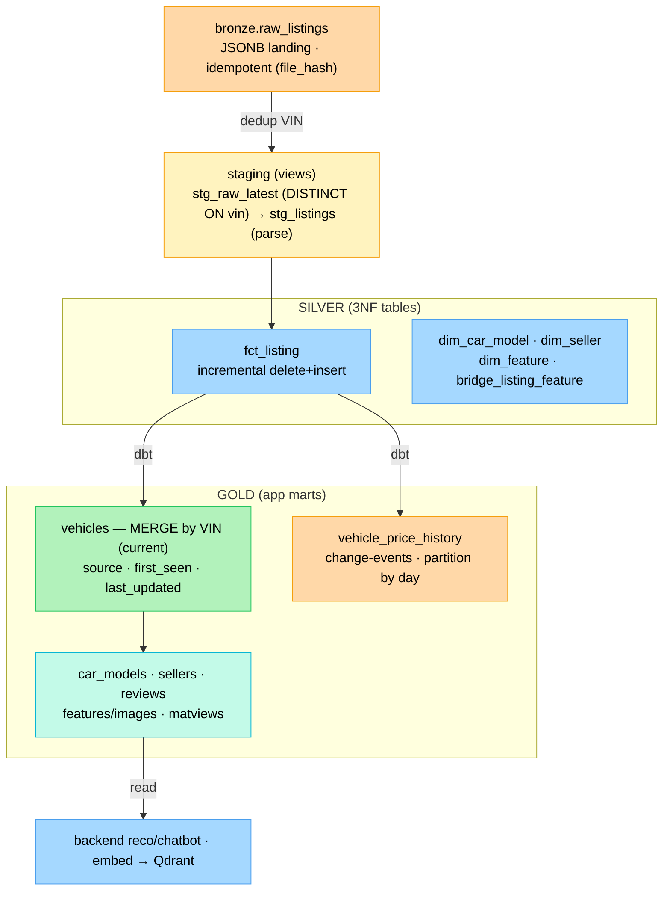
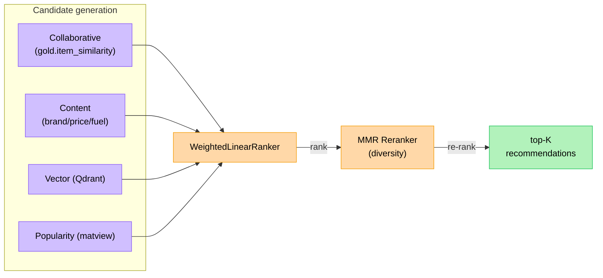
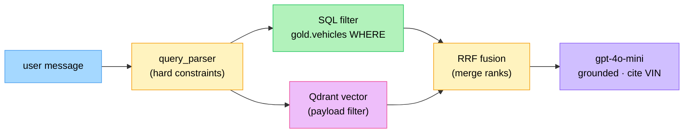
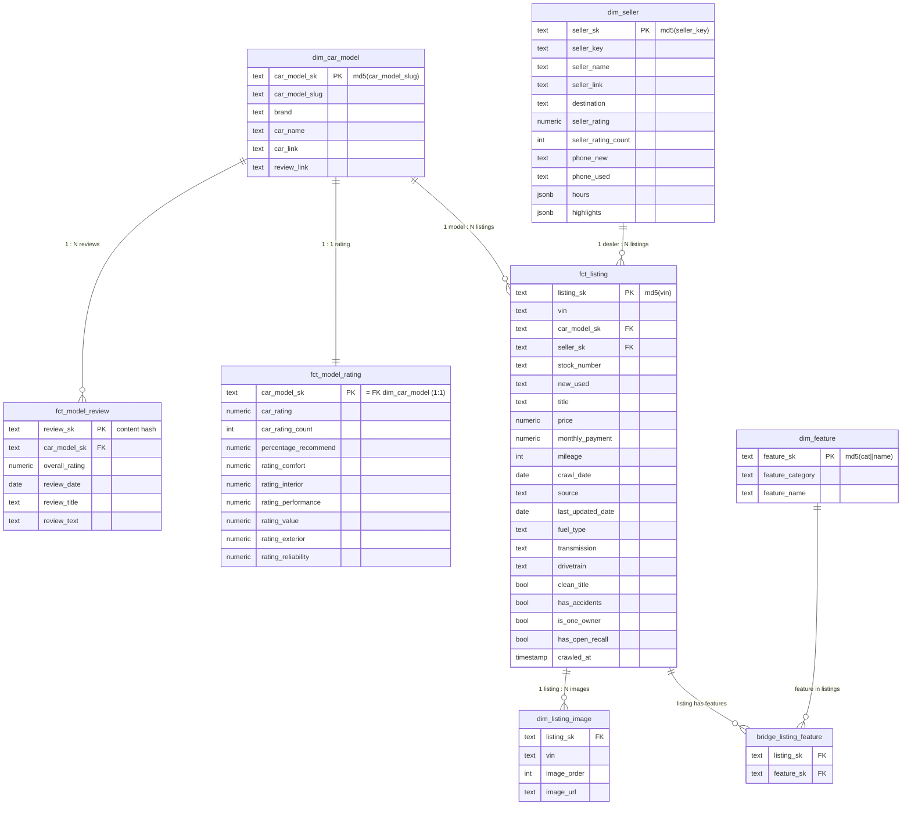
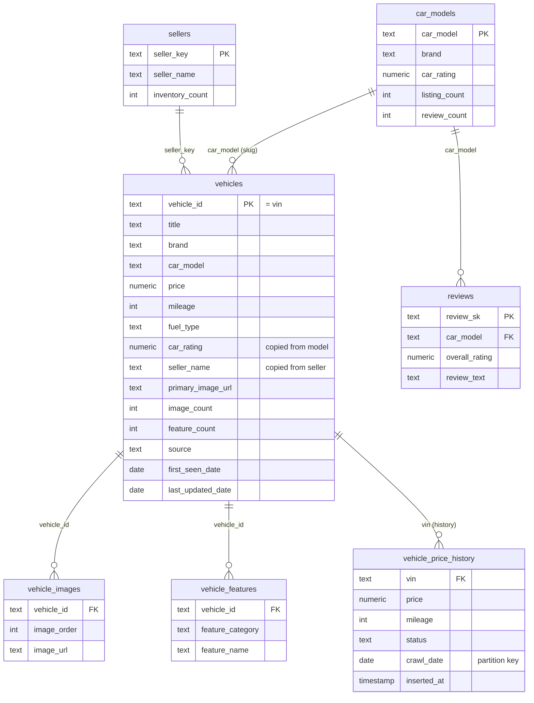
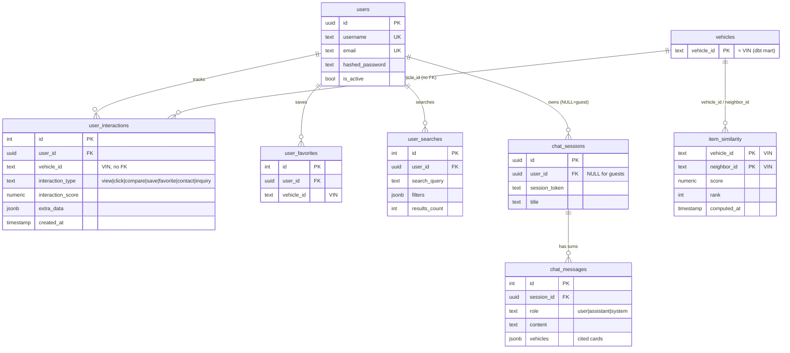
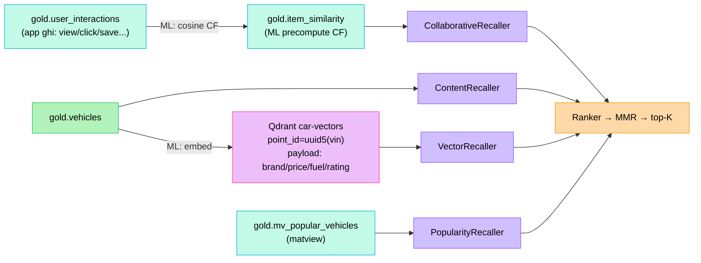

# Architecture Diagrams (Mermaid)

Các sơ đồ dưới đây dùng **Mermaid** — render trực tiếp trên GitHub, [mermaid.live](https://mermaid.live),
VSCode (extension *Markdown Preview Mermaid*), hoặc Notion. Đã verify render ra SVG hợp lệ.

> Muốn có logo Docker/Postgres/Temporal nhúng trong chart? Mermaid hỗ trợ qua
> `@{ icon: "logos:postgresql" }` (v11.3+) **nhưng chỉ hiển thị trên trình render bật
> *iconify*** (mermaid.live) — GitHub README sẽ hiện dấu `?`. Vì vậy các diagram dưới
> dùng **màu + label** để render đẹp ở mọi nơi.

---

## 1. Kiến trúc tổng thể

---

## 2. Temporal pipeline — WeeklyPipeline

---

## 3. dbt medallion — data flow

---

## 4. Recommendation engine (multi-stage hybrid)

---

## 5. Chatbot — RAG hybrid retrieval

---

## 6. SILVER — ERD (3NF dimensional)

Surrogate key = `md5(natural_key)`, NULL-safe. FK được enforce bằng dbt
`relationships` tests (không dùng FK cứng vì gold rebuild). **Grain rule:** dữ liệu
`car.*` (rating/reviews) thuộc về car MODEL — keyed `car_model_sk`, không bao giờ per-listing.

---

## 7. GOLD — ERD (app marts, denormalized)

Gold làm phẳng silver (join sẵn) để backend đọc nhanh. Quan hệ qua
`vehicle_id = vin` (TEXT, không FK cứng — `gold.vehicles` bị dbt DROP/CREATE).
`vehicles` MERGE theo VIN (current state); `vehicle_price_history` append (change-events).

---

## 8. Recommendation / App-domain ERD

Khác với marts dbt (#7) — đây là các bảng **app ghi runtime** + **ML precompute** +
**Qdrant vector**, là input/output của hệ thống đề xuất.

- `users · user_interactions · user_favorites · user_searches · chat_*` — backend ghi (có FK cứng tới `users`).
- `item_similarity` — **ML workflow** precompute (item-item CF), reco đọc, không fit runtime.
- `mv_popular_vehicles` — matview (cold-start fallback).
- `vehicle_id` (TEXT = VIN) nối tới `gold.vehicles` nhưng **không FK cứng** (vehicles bị dbt rebuild).

### Hệ thống đề xuất dùng các store này thế nào

